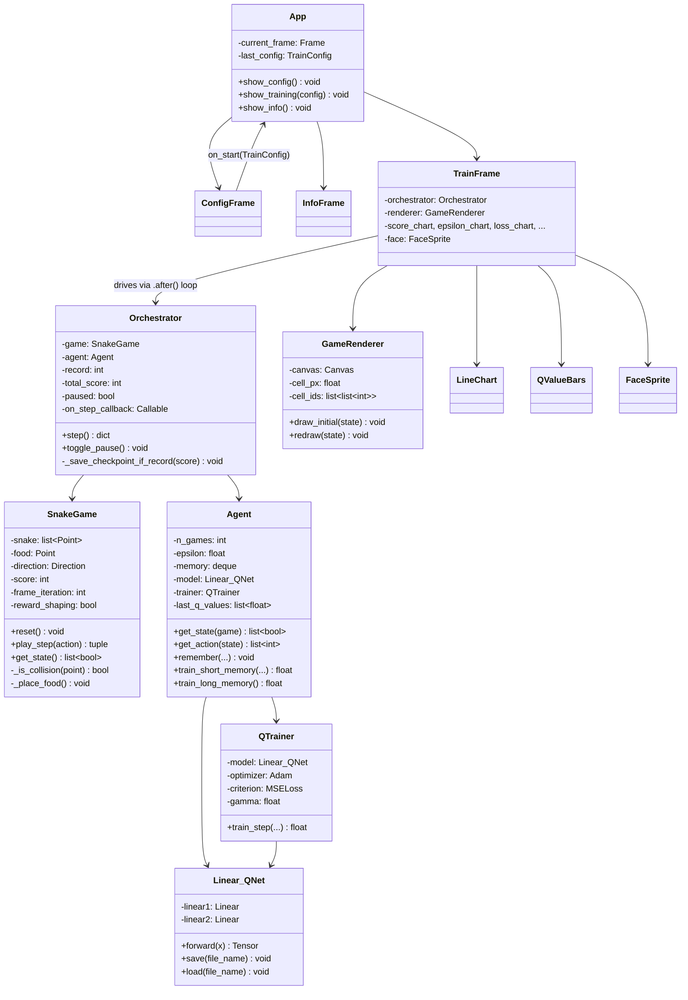
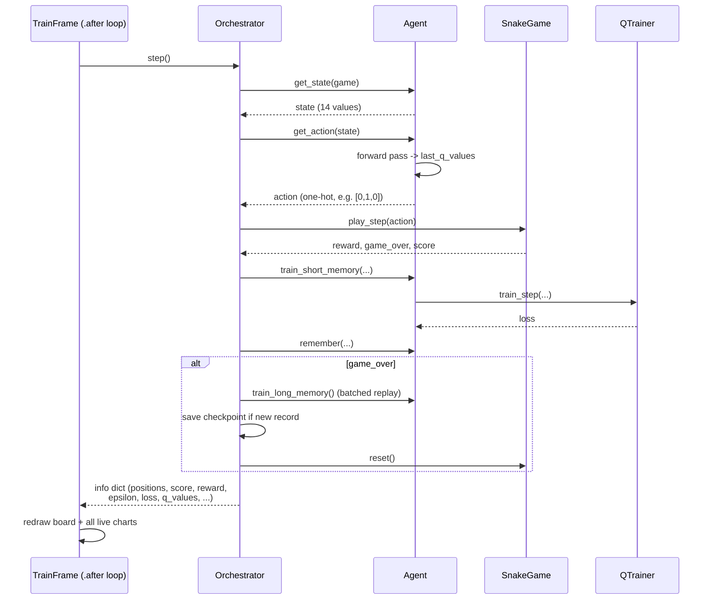

# 🐍 Snake DQN

A Snake game that plays itself, built from scratch, one class at a time: The game engine, the neural net, the training loop and a full retro-styled GUI to watch it learn (or panic) in real time.

No off-the-shelf RL library. No copy-pasted `SnakeGameAI` class. Every piece here, the collision detection, the Bellman update, the epsilon decay, etc. was built and debugged from first principles, mostly to actually understand *why* DQN works instead of just importing it.

> Same author, new house: This repo picks up from where [tamagochi-descompuesto](https://github.com/tamagochi-descompuesto) left off.

---

## Table of contents

- [What's actually happening here](#whats-actually-happening-here)
- [Deep Q-Learning, briefly](#deep-q-learning-briefly)
- [The state vector](#the-state-vector)
- [Reward design](#reward-design)
- [Architecture](#architecture)
- [One training step, start to finish](#one-training-step-start-to-finish)
- [The GUI](#the-gui)
- [Project structure](#project-structure)
- [Getting started](#getting-started)
- [Dev log highlights](#dev-log-highlights-aka-things-that-actually-moved-the-needle)
- [What's next](#whats-next)

---

## What's actually happening here

An agent plays Snake using a **Deep Q-Network (DQN)**: A small neural network that learns, purely through trial and error, which move is worth the most in any given situation. Nobody hand-codes "beware, oyu have a wall avoid" or "go toward the food", that behavior *emerges* from thousands of games of dying, occasionally succeeding, and slowly updating a couple hundred numbers until it stops being terrible.

The project was built in stages (MVP first, everything else after):

1. **The game itself**: Playable standalone, no AI, just to make sure the rules are actually correct before blaming a neural net for bugs that live in the system.
2. **A random agent**: Proves the training *loop* works, isolated from the question of whether learning happens.
3. **The DQN**: Network, trainer, agent. The one metric that matters: Does the average score go up over time?
4. **Checkpointing**: Survive a `Ctrl+C` without losing progress.
5. **A live GUI**: Watch it happen instead of squinting at console logs.
6. **"Steroids"**: Reward shaping, a longer danger radius, a full retro dashboard with live charts and a status portrait. This is most of what makes the repo worth showing off.

---

## Deep Q-Learning, briefly

At every frame, the agent gets a **state** `s` (11 to 14 numbers describing what's immediately around the snake), picks an **action** `a` (turn left / right / go straight), and gets a **reward** `r` back from the environment. The network's job is to learn a function `Q(s, a)` that basically tells us: *How good is it to take action `a` in state `s`?* (**spoiler:** good enough that always picking `argmax_a Q(s, a)` plays a decent game of Snake).

### The Bellman update

Since we only get ground truth for the action we actually took, we can't fully supervise the other two. Instead, each training step corrects just the one slot we have information about, using the Bellman equation:

$$
Q_{\text{target}}(s, a) =
\begin{cases}
r & \text{if the game ended} \\
r + \gamma \cdot \max_{a'} Q(s', a') & \text{otherwise}
\end{cases}
$$

- `r`: The reward from that step.
- `γ` (gamma, default `0.9`): How much future reward matters relative to the immediate one.
- `max_{a'} Q(s', a')`: The network's own best guess of *"how good is the state I just landed in"*; a bootstrap, not ground truth.

The network is then nudged toward that target with plain MSE loss:

$$
\mathcal{L} = \frac{1}{N} \sum_{i=1}^{N} \left( Q_{\text{target}}(s_i, a_i) - Q_{\text{pred}}(s_i, a_i) \right)^2
$$

### Epsilon-greedy exploration

Early on, the network's opinions are worthless (random init), so the agent should mostly *not* trust them yet:

$$
\epsilon = \epsilon_{\text{start}} - n_{\text{games}}
$$

Each decision rolls `rand(0, 200)`; if it's less than `ε`, the agent explores (random move). As `n_games` climbs, `ε` shrinks toward (and past) zero. By game 100 (with the default `ε_start = 100`), the agent trusts the network exclusively.

### The network

```
Linear_QNet(
  state: 14 floats
    │
    ▼
  Linear(14 → 256)
    │
    ▼
  ReLU                 # without this, two stacked Linear layers
    │                  # collapse into one; no non-linearity, no point
    ▼
  Linear(256 → 3)
    │
    ▼
  3 raw Q-values        # [straight, right, left] no softmax, these
                         # are value estimates, not a probability dist.
)
```

---

## The state vector

14 booleans, entirely relative to the snake's own heading. No absolute directions, no raw coordinates:

| # | Feature | Meaning |
|---|---|---|
| 0 | `danger_ahead` | Wall or body 1 cell straight ahead |
| 1 | `danger_left` | Wall or body 1 cell to the relative left |
| 2 | `danger_right` | Wall or body 1 cell to the relative right |
| 3 | `danger_ahead_x2` | Same, but 2 cells out |
| 4 | `danger_left_x2` | Same, but 2 cells out |
| 5 | `danger_right_x2` | Same, but 2 cells out |
| 6–9 | `dir_left/right/up/down` | One-hot: Which absolute direction is the snake currently heading |
| 10–13 | `food_left/right/up/down` | Which quadrant the food is in, relative to the head |

The `x2` lookahead (features 3–5) wasn't in the original design, it got added after the agent plateaued hard around a record of ~130. With only 1-cell lookahead, the network is structurally blind to anything beyond immediate danger, so a long snake has no way to *see* it's about to trap itself. Extending the danger radius to 2 cells took the very first fully-exploiting generation afterward from a record of 130 straight to 420. Turns out most of the *"why won't it learn past this point"* was a perception problem, not a training problem (see [dev log](#dev-log-highlights-aka-things-that-actually-moved-the-needle)).

---

## Reward design

| Event | Reward |
|---|---|
| Eats food | `+10` |
| Dies (wall or self-collision) | `-10` |
| Any other step (baseline) | `0` |
| Step gets closer to food *(reward shaping, opt-in)* | `+0.1` |
| Step moves away from food *(reward shaping, opt-in)* | `-0.1` |

Reward shaping compares Manhattan distance to the food before and after the move:

$$
d(s) = |x_{\text{head}} - x_{\text{food}}| + |y_{\text{head}} - y_{\text{food}}|
$$

$$
r_{\text{step}} =
\begin{cases}
+0.1 & \text{if } d(s_{t+1}) < d(s_t) \\
-0.1 & \text{otherwise}
\end{cases}
$$

This alone was the single biggest lever in the whole project (see the numbers in the [dev log](#dev-log-highlights-aka-things-that-actually-moved-the-needle)).

There's also a **step limit**: if the snake goes more than `100 × len(snake)` steps without eating, the episode force-ends (as a death). Without it, a large, well-fed snake that isn't actively suicidal but also isn't *doing* anything can loop forever near the food, since a `0`-reward step and a genuinely useful step look identical to a network with no per-step signal.

---

## Architecture



**Why it's split up this way:**

- **`SnakeGame`** knows nothing about AI, Tkinter, or PyTorch. It's a self-contained rulebook: Snake, food, collisions, score. This is what made it possible to verify the game logic completely separately from ever asking *"is my AI broken?"*
- **`Linear_QNet`** is *only* the network's forward pass and persistence. It doesn't know it's playing Snake.
- **`QTrainer`** owns the Bellman math and the optimizer step. It receives a model rather than constructing its own, so the same weights the `Agent` uses to *act* are the ones actually being trained. A subtle bug in an earlier draft had `QTrainer` instantiate its own throwaway network, which trains something nobody ever looks at again.
- **`Agent`** is the glue: Epsilon-greedy action selection, short/long-term memory (replay buffer), checkpoint save/load. It has zero Tkinter knowledge.
- **`Orchestrator`** is what lets the *exact same* training logic run either headless (fast, thousands of games for real training) or driven frame-by-frame from a GUI event loop `step()` does one game tick and hands back a plain `dict`, so the GUI layer never has to know anything about RL internals.
- **GUI layer** (`App` / `ConfigFrame` / `TrainFrame` / `InfoFrame`) only exists to *display* what `Orchestrator.step()` already computed. None of the RL code imports `tkinter`.

---

## One training step, start to finish



---

## The GUI

Fullscreen, retro-styled, split into:

- **The board**. The live game, plus a tiny status portrait (art, swaps between *normal / eating / dead*).
- **`STATE`**. The exact 14 values the network is seeing this frame.
- **`PER STEP`**. Q-values for all 3 actions (with the chosen one highlighted), loss, reward, and steps-survived-this-game, all updating every single frame.
- **`PER GENERATION`**. Score, epsilon, and mean score, updating once per completed game. The actual *"is it learning?"* signal.

<!-- Drop screenshots/GIFs in assets/screenshots/ and reference them here, e.g.: -->
<!--  -->

---

## Project structure

```
snk_py/
├── app.py                     # entry point: python app.py
├── libs/
│   ├── snake_game/            # the rulebook — no AI, no GUI
│   │   └── snake_game.py
│   ├── model/                 # the network
│   │   └── linear_qnet.py
│   ├── main/                  # training brains
│   │   ├── qtrainer.py
│   │   ├── agent.py
│   │   └── orchestrator.py
│   ├── render/                # tk.Canvas board renderer
│   │   └── game_renderer.py
│   └── gui/                   # the retro dashboard
│       ├── app.py
│       ├── theme.py
│       ├── config_frame.py
│       ├── train_frame.py
│       ├── info_frame.py
│       ├── score_chart.py     # LineChart + ScoreChart
│       ├── bar_chart.py       # QValueBars
│       └── face_sprite.py
├── assets/faces/               # normal.png / eat.png / game_over.png
├── model/                       # checkpoints (gitignored, generated locally)
└── *.py at the root             # earlier standalone scripts (Steps 0-3),
                                  # kept around for anyone who wants to see
                                  # the console-only / no-GUI versions
```

---

## Getting started

```bash
git clone <this-repo>
cd snk_py

python -m venv .venv
.venv\Scripts\activate        # Windows
# source .venv/bin/activate   # macOS/Linux

pip install -r requirements.txt

python app.py
```

No checkpoint ships with the repo (see `.gitignore`). The agent trains from scratch. Check "Load existing checkpoint" in the config screen once you've trained something worth keeping; it'll resume from `model/model.pth` if that file exists.

---

## Dev log highlights (aka things that actually moved the needle)

A few numbers from the actual training runs, because "trust me it learns" is a bad look in a repo about a system that's specifically supposed to prove itself with evidence:

| Change | Record | Mean score |
|---|---|---|
| Baseline (flat reward, no step limit) | plateaued hard, looped forever | ~1–3 |
| + step limit (kills endless loops) | 130 (gen ~166) | 3.21 |
| + reward shaping (distance-based) | 530 (gen ~135) | ~32 |
| + 2-cell danger lookahead (14-value state) | 420 on the very first fully-exploiting generation | — |

The pattern that kept showing up: A lot of *"why is training stuck"* turned out to be **information problems, not learning problems**. The network can't act on what it structurally can't perceive. Reward shaping and the longer danger radius both worked by giving the network *more signal per step*, not by training it longer.

---

## What's next

- `ConfigFrame` already exposes `gamma`, starting `epsilon`, render speed, and reward shaping; future runs are meant to be compared, not just eyeballed.
- Full-grid + CNN state representation, for real self-avoidance instead of a fixed lookahead radius which allows the network to improve but just to a certain point.
- A proper target network (currently `QTrainer` bootstraps off the same weights it's updating, works fine here, but it's the textbook next step for stability).

---

Built by [Israel](https://github.com/tamagochi-descompuesto1); same guy who's also been known to make NLP models do things they probably shouldn't. Questions, roasts, and PRs welcome.
